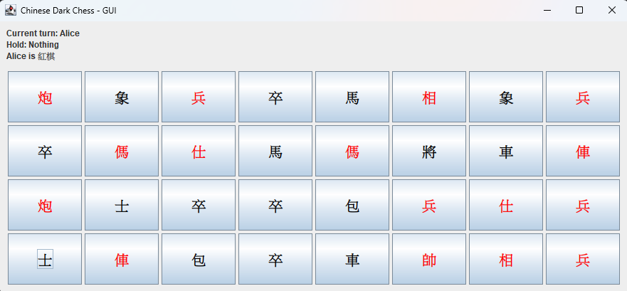
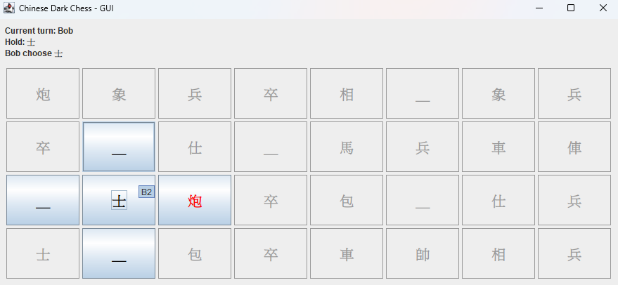
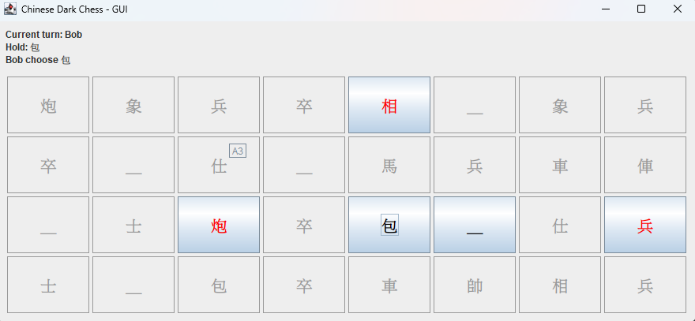

# H1 Report

* Name: 賴建宇
* ID: D1150254

---

## 題目：象棋翻棋遊戲
> * 考慮一個象棋翻棋遊戲，32 個棋子會隨機的落在 4*8的棋盤上。透過 Chess 的建構子產生這些棋子並隨機編排位置，再印出這些棋子的名字、位置
> 	* ChessGame
> 	    * void showAllChess();
> 	    * void generateChess();
> 	* Chess:
> 	    * Chess(name, weight, side, loc);
> 	    * String toString();
> * 同上，
>     * ChessGame 繼承一個抽象的 AbstractGame; AbstractGame 宣告若干抽象的方法：
>         * setPlayers(Player, Player)
>         * boolean gameOver()
>         * boolean move(int location)
> * 撰寫一個簡單版、非 GUI 介面的 Chess 系統。使用者可以在 console 介面輸入所要選擇的棋子的位置 (例如 A2, B3)，若該位置的棋子未翻開則翻開，若以翻開則系統要求輸入目的的位置進行移動或吃子，如果不成功則系統提示錯誤回到原來狀態。每個動作都會重新顯示棋盤狀態。
> * 規則：請參考 [這裏](https://zh.wikipedia.org/wiki/%E6%9A%97%E6%A3%8B#%E5%8F%B0%E7%81%A3%E6%9A%97%E6%A3%8B)
>
> ```
>    1   2   3  4   5  6   7   8
> A  ＿  兵  ＿  車  Ｘ  ＿  象  Ｘ
> B  Ｘ  ＿  包  Ｘ  士  ＿  馬  Ｘ   
> C  象  兵  Ｘ  車  馬  ＿  ＿  將 
> D  Ｘ  包  ＿  士  兵  Ｘ  ＿  Ｘ  
> ```

## 程式執行方法
* 執行 CLI 版本在src/main/java/org/example/Main.java 直接執行
* 執行 GUI 版本在org/example/gui/GuiMain.java 直接執行

## 設計方法概述
### 設計方法總覽
   * 以 AbstractGame 這個抽象的類別定義遊戲主體框架(gameOver()、move())。
   * 以 ChessGame 繼承 AbstractGame 後實作暗棋規則與回合控制。
   * 以 Chess 封裝棋子屬性（名稱、陣營、位置、翻面狀態、等級）。
   * 以 Player 管理玩家資訊（名稱、陣營）。

### Player
* **屬性：**
    * `name`: 玩家名稱。
    * `side`: 所屬陣營（黑/紅）。`-1` 代表遊戲初期尚未確定陣營。

### AbstractGame
* **屬性欄位：** `player1` (Player), `player2` (Player)
* **核心方法：**
    * `setPlayer(...)`: 設定玩家資訊。
    * `move(...)`: 定義移動邏輯（由子類實作）。
    * `gameOver()`: 定義結束判定基準。

### Chess
| 屬性       | 屬性名稱                   | 功能說明 |
|:---------|:-----------------------| :--- |
| **靜態屬性** | `name`, `type`, `side` | 棋子的名稱、等級種類與所屬陣營。 |
| **動態狀態** | `location`, `isTurned` | 記錄棋子目前的位置，以及是否已被翻開。 |

### ChessGame
### 核心屬性
* `Chess[] board`: 用於紀錄當前棋盤狀態（長度 32 的陣列）。
* `Player curPlayer`: 當前行動玩家。
* `int selectLocation`: 已選取之棋子位置（`-1` 表示尚未選取）。

### 核心方法
| 方法名稱 | 職責描述 |
| :--- | :--- |
| `generateChess()` | 初始化棋組並進行隨機洗牌。 |
| `showBoard()` | 輸出當前棋盤狀態畫面。 |
| `move(int location)` | 處理翻子、選子、移動與吃子四大核心行為。 |
| `isValidMove()` | 根據規則判定吃子或移動的合法性。 |
| `gameOver()` | 判斷是否達成勝負條件。 |

## 程式、執行畫面及其說明
### 初始化隨機棋盤
為了滿足中國象棋暗棋的開局隨機擺放棋子的規則，在`generateChess()` 中
先使用了 `List<Chess>` 暫存棋子，並依照 `chessName`、`chessType`、`side` 
建立 32 個 `Chess` 物件，再以 `Collections.shuffle()` 進行隨機排序，最後
將 32 個 `Chess` 物件放置到對應的 `board[32]` 棋盤上。

```java
private void generateChess() {
  List<Chess> temp = new ArrayList<>();
  for (int i = 0; i < 32; i++) {
    temp.add(new Chess(chessName[i], chessType[i % 16], i / 16, -1));
  }
  Collections.shuffle(temp);
  for (int i = 0; i < 32; i++) {
    board[i] = temp.get(i);
    board[i].setLocation(i);
  }
}
```

### 回合流程控制
`move(int location)` 是控制整個遊戲流程的核心，其負責處理玩家在進行輸入可能觸發的所有行為：翻棋、
選棋、改選棋子、移動棋子、吃子，以及非法的移動的回饋
這個方法以 `selectionLocation` 作為狀態控制形成兩個階段
  * 1. `selectLocation == -1` :尚未選子，只能翻開棋子或是選擇己方已翻開的棋子
  * 2. `selectLocation != -1` :已選子，可以嘗試移動、吃子，或是改選己方其他已翻開的棋子

`move(int location)` 還有另一個重要的功能，在當前玩家陣營尚未決定，也就是 `side == -1` 時，
翻開第一個棋子後會自動綁定兩位玩家的陣營

```java
public boolean move(int location) {
        if (location < 0 || location >= 32) {
            System.out.println("Invalid location!");
            return false;
        }

        Chess targetChess = board[location];

        if (selectLocation == -1) {
            if (targetChess == null) {
                System.out.println("No chess at this location!");
                return false;
            }
            if (!targetChess.getisTurned()) {
                targetChess.setisTurned();
                if (curPlayer.side == -1) {
                    curPlayer.side = targetChess.getSide();
                    player2.side = targetChess.getSide() == 1 ? 0 : 1;
                    System.out.println(player1.name + "is " + (curPlayer.side == 0 ? "黑棋" : "紅棋"));
                }
                return true;
            }
            if (targetChess.getSide() != curPlayer.side) {
                System.out.println("This chess belongs to the opponent!");
                return false;
            }
            selectLocation = location;
            System.out.println(curPlayer.name + " choose " + targetChess.getName());
            return false;
        } else {
            Chess movingChess = board[selectLocation];
            if (targetChess != null && targetChess.getisTurned() && targetChess.getSide() == curPlayer.side) {
                selectLocation = location;
                System.out.println(curPlayer.name + " choose " + targetChess.getName());
                return false;
            }
            if (targetChess != null && isValidMove(movingChess, targetChess)) {
                System.out.println(movingChess.getName() + "eat" + targetChess.getName());

                board[location] = movingChess;
                movingChess.setLocation(location);
                board[selectLocation] = null;
                selectLocation = -1;
                return true;
            } else if (targetChess == null) {
                int row1 = movingChess.getLocation() / 8, col1 = movingChess.getLocation() % 8;
                int row2 = location / 8, col2 = location % 8;
                int distance = Math.abs(row1 - row2) + Math.abs(col1 - col2);
                if (distance != 1) {
                    selectLocation = -1;
                    System.out.println("Invalid move!");
                    return false;
                }
                System.out.println(movingChess.getName() + "move success");
                board[location] = movingChess;
                movingChess.setLocation(location);
                board[selectLocation] = null;
                selectLocation = -1;
                return true;
            } else {
                selectLocation = -1;
                System.out.println("Invalid move!");
                return false;
            }
        }
    }
```

### 棋子移動合法判定
`isValidMove()` 用於判定玩家下的吃子指令是否符合中國象棋暗棋的規則，
在 `move()` 方法中執行 `isValidMove()` 之前先排除目標為翻開、同陣營、同位置
在 `move()` 中，分為一般規則以及例外規則
* 1. 一般規則: 當前要移動的棋子不為包或炮時，使用曼哈頓距離以及棋子之間的大小關係進行判斷
* 2. 例外規則：當前要移動的棋子為包或炮時，要移動的棋子跟目標之間必須剛好有一顆棋子

```java
private boolean isValidMove(Chess movingChess, Chess targetChess) {
        if (!targetChess.getisTurned() || movingChess.getSide() == targetChess.getSide() || 
                movingChess.getLocation() == targetChess.getLocation()) {
            return false;
        }

        int row1 = movingChess.getLocation() / 8;
        int col1 = movingChess.getLocation() % 8;
        int row2 = targetChess.getLocation() / 8;
        int col2 = targetChess.getLocation() % 8;
        int distance = Math.abs(row1 - row2) + Math.abs(col1 - col2);

        if (movingChess.getType() == 2) {
            int count = 0;
            if (row1 == row2) {
                for (int i = Math.min(col1, col2) + 1; i < Math.max(col1, col2); i++) {
                    if (board[row1 * 8 + i] != null) count++;
                }
            } else if (col1 == col2) {
                for (int i = Math.min(row1, row2) + 1; i < Math.max(row1, row2); i++) {
                    if (board[i * 8 + col1] != null) count++;
                }
            }
            return count == 1;
        }

        if (distance != 1) return false;
        if (movingChess.getType() == 7 && targetChess.getType() == 1) return false;
        if (movingChess.getType() == 1 && targetChess.getType() == 7) return true;
        return movingChess.getType() >= targetChess.getType();
    }
}
```
### GUI顯示畫面
通過java自帶的swing GUI 來顯示出中國象棋暗棋的棋盤，其中棋子使用按鈕 `JButton` 來讓使用者可以直接透過 GUI 和遊戲互動，
不再需要手動輸入移動指令，並根據棋子的陣營在對應的 `JButton` 上修改顯示棋子的顏色優化使用者體驗



進一步優化使用者體驗，在玩家選擇要移動的棋子時， `JButton` 會動態的將是非法移動的位置的 `JButton` 設為不可點選的模式



# AI 使用狀況與心得
## 層級2 用來除錯，且改善功能、架構
在 CLI 版本的中國象棋暗棋，全部都是我自己撰寫的，在這其中只有詢問 AI 有關於 JAVA 產生亂序的內建函數

而在 GUI 版本的中國象棋中，我使用 AI 來對 CLI 版本的中國象棋暗棋進行修改，使其產生一個 GUI 版本的中國象棋暗棋程式
我先使用了 github copilot 的 plan 功能，再使用 agent 功能把 plan 的結果進行實作出來，下的 prompt 為 
* 根據Main.java中的中國象棋遊戲程式碼，設計這個遊戲的gui，給出具體的規畫以及使用的套件
* 根據上方的步驟，進行程式碼的撰寫，但是不要更改Readme.md中的內容，套件方案: javax.swing/java.awt，棋子呈現策略:文字，規則要與console完全一致

## 心得
在這份功課中，我學習到了在撰寫 OOP 程式時，應該要先完善設計出想要的功能以及每個 Class 的屬性及方法，這樣可以避免在撰寫程式碼到一半時
發現自己的架構沒有設計好，導致某些功能要實現必須走彎路，或是必須重新設計架構。

而在使用 AI 幫助寫程式的部分，雖然 AI 產出程式碼的速度很快，但是依然必須人工進行code review 一次，而不是大略的測試過功能就好
舉例來說，在 GUI 程式碼中， AI 產生的程式碼有重複呼叫 `Chess 的 getLocation()` 函式，即使前面已經呼叫過了不需要再次呼叫，在
目前的程式中看似沒有太大的問題，但是如果遇到的使用情境對於程式的效率有很高的要求，而 AI 又重複的呼叫了一個會耗費大量時間的函式，則
會造成不必要的程式執行時間開銷。